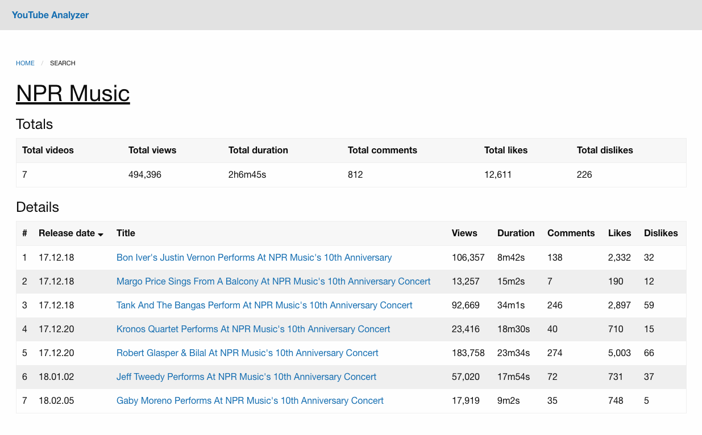

# youtubeanalyzer.com

Get total views/duration/likes and more for Youtube playlists and channels.



## Getting Started
```
npm install
npm run dev
--> localhost:3000
```

## Testing
```
npm run test
```

## Tech
- [React](https://reactjs.org/)
- [Next.js](https://nextjs.org/)
- [YouTube API](https://developers.google.com/youtube/)
- [Foundation](https://foundation.zurb.com/)
- [Flow](https://flow.org/)